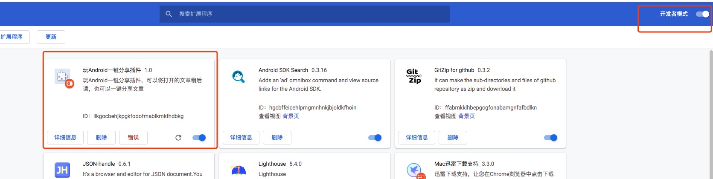
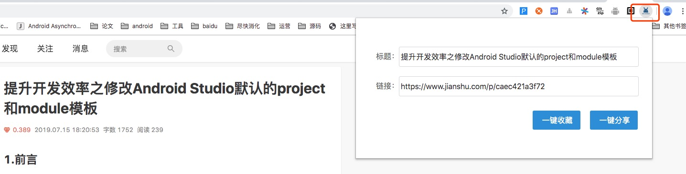

## 官方网站


* [http://www.wanandroid.com/](http://www.wanandroid.com/)


在这里您可以：

* 任何建议或者遇到什么问题，可以在[提问题](https://github.com/hongyangAndroid/wanandroid/issues)反馈。
* 也可以加入交流群：591683946
* 还可以选择[赞助本站](http://www.wanandroid.com/blog/show/2030)


## 本站开放 API

本站几乎所有的数据都对外开放，所以你可以写一个你自己喜欢的 App.

[https://www.wanandroid.com/blog/show/2](https://www.wanandroid.com/blog/show/2)

## 收藏插件

为了更好的使用本站，我们开发了一个插件。

你可以非常轻松的完成，文章的分享以及收藏。

安装：

1. 将[wanandroid\_chrome\_plugin.crx](wanandroid_chrome_plugin/wanandroid_chrome_plugin.crx) 下载
2. 打开 chrome 扩展程序
3. 开启开发者模式
4. 将 crx 拖入即可



使用：

1. 保持网站登录状态；
2. 点击图标，点击收藏 or 分享即可。




## 详细 API

为了满足大家开发小程序等需求，目前本站完全迁移到https下，如果你是开源项目开发者，请尽快迁移 base url 为 https。

目前已知问题：

1. http 下登录、注册无法使用 -> 请使用https


baseurl 请使用：


```
https://www.wanandroid.com
```

**将所有的 http 改为https，即完全支持！**


## 一些更新

>更新一些接口变化的地方，具体看对应章节。有问题请在[https://github.com/hongyangAndroid/wanandroid/issues](https://github.com/hongyangAndroid/wanandroid/issues)反馈。

### 2018-10-13 公众号Tab

 增加微信公众号 Tab，查看公众号文章，支持搜索，。

#### 获取公众号列表

```
https://wanandroid.com/wxarticle/chapters/json  
方法： GET
```

#### 查看某个公众号历史数据

```
https://wanandroid.com/wxarticle/list/408/1/json
方法：GET
参数：
	公众号 ID：拼接在 url 中，eg:405
	公众号页码：拼接在url 中，eg:1
```

#### 在某个公众号中搜索历史文章

```
https://wanandroid.com/wxarticle/list/405/1/json?k=Java
方法：GET
参数 ：
	k : 字符串，eg:Java
	公众号 ID：拼接在 url 中，eg:405
	公众号页码：拼接在url 中，eg:1
```


### 2018-10-10 最新项目 Tab

#### 最新项目tab (首页的第二个tab)

按时间分页展示所有项目。

```
https://wanandroid.com/article/listproject/0/json

方法：GET
参数：页码，拼接在连接中，从0开始。

```


### 2018-08-26

1. 增加 logout 退出接口，见5.3；
2. 修改未登录的错误码为-1001，其他错误码为-1，成功为0，建议对errorCode 判断当不为0的时候，均为错误。

<hr/>

>由于早期开放的一些API页码为0开始，后期接口修改为从1开始，为了兼顾之前的开放API，故无法统一。
>
>对于POST接口建议使用postman模拟

在编写过程中如果遇到一些问题，也有一些参考项目，这里针对Java和Kotlin各自选择了一款：

* java版本开源：[wanandroid开源客户端Java版本](https://www.wanandroid.com/blog/show/2075)
* kotlin版本开源：[wanandroid开源客户端kotlin版本](https://www.wanandroid.com/blog/show/2029)
* flutter版本开源：[wanandroid开源flutter版本](https://github.com/hurshi/wanandroid )

>开源项目或多或少包含一些问题，仅供参考，最好自己写一个啦~
如果你想装一个使用，建议下载kotlin那个版本，我一直在使用，较为稳定。

当然你也可以在github上[搜索wanandroid](https://github.com/search?q=wanandroid)。

返回数据结构定义:

```
{
    "data": ...,
    "errorCode": 0,
    "errorMsg": ""
}

```

所有的返回结构均为上述，其中errorCode如果为负数则认为错误，此时errorMsg会包含错误信息。data为Object，返回数据根据不同的接口而变化。

1. errorCode = 0 代表执行成功，不建议依赖任何非0的 errorCode.
2. errorCode = -1001 代表登录失效，需要重新登录。


>如果遇到接口错误，请及时通过[https://github.com/hongyangAndroid/wanandroid](https://github.com/hongyangAndroid/wanandroid)反馈。


对于需要登录访问的接口，强烈建议阅读下：

* [Postman 模拟带 cookie 的请求](https://www.wanandroid.com/blog/show/2268)


## 1.首页相关

### 1.1 首页文章列表


```
https://www.wanandroid.com/article/list/0/json

方法：GET
参数：页码，拼接在连接中，从0开始。

```

**很多 H5 页面会恶意跳转淘宝等，可以在 webview 的 shouldOverrideUrlLoading 中做一下拦截，非常影响用户体验。**

可直接点击查看示例：[https://www.wanandroid.com/article/list/1/json](https://www.wanandroid.com/article/list/1/json)。

注意：页码从0开始，拼接在链接上。

其中有两个易混淆的字段:

```
"superChapterId": 153, 
"superChapterName": "framework", // 一级分类的名称
```

superChapterId其实不是一级分类id，因为要拼接跳转url，内容实际都挂在二级分类下，所以该id实际上是一级分类的第一个子类目的id，拼接后故可正常跳转。


有两个字段比较容易混淆：

author 与 shareUser

网站上的文章可能是某位作者author的，也可能是某位分享人shareUser分享的。

如果是分享人分享的，author 为 null。

**注意：除了文字标题，链接，其他字段都可能为null，一定要注意布局下发 null 时的显示情况。**

### 1.2 首页banner

```
https://www.wanandroid.com/banner/json

方法：GET
参数：无

```

可直接点击查看示例：[https://www.wanandroid.com/banner/json](https://www.wanandroid.com/banner/json)


### 1.3 常用网站

```
https://www.wanandroid.com/friend/json

方法：GET
参数：无
```

可直接点击查看示例：[https://www.wanandroid.com/friend/json](https://www.wanandroid.com/friend/json)

### 1.4 搜索热词

即目前搜索最多的关键词。

```
https://www.wanandroid.com//hotkey/json

方法：GET
参数：无
```

可直接点击查看示例：[https://www.wanandroid.com/hotkey/json](https://www.wanandroid.com//hotkey/json)

### 1.5 置顶文章

```
https://www.wanandroid.com/article/top/json
```

## 2. 体系

### 2.1 体系数据

```
https://www.wanandroid.com/tree/json

方法：GET
参数：无

```
可直接点击查看示例：[https://www.wanandroid.com/tree/json](https://www.wanandroid.com/tree/json)

主要标识的网站内容的体系结构，二级目录。部分数据参考：

```java
{
    "children": [
        {
            "children": [],
            "courseId": 13,
            "id": 60, // id会在查看该目录下所有文章时有用
            "name": "Android Studio相关", // 子名称
            "order": 1000,
            "parentChapterId": 150,
            "visible": 1
        },...
    ],
    "courseId": 13,
    "id": 150,
    "name": "开发环境", // 一级的名称
    "order": 1,
    "parentChapterId": 0,
    "visible": 1
}
```


### 2.2 知识体系下的文章

```
https://www.wanandroid.com/article/list/0/json?cid=60

方法：GET
参数：
	cid 分类的id，上述二级目录的id
	页码：拼接在链接上，从0开始。
```


例如查看类别：Android Studio下所有的文章：[https://www.wanandroid.com/article/list/0/json?cid=60](https://www.wanandroid.com/article/list/0/json?cid=60)

### 2.3 按照作者昵称搜索文章

```
https://wanandroid.com/article/list/0/json?author=鸿洋

	方法:GET
	页码：拼接在链接上，从0开始。
	author：作者昵称，不支持模糊匹配。


```


## 3. 导航

### 3.1 导航数据


```
https://www.wanandroid.com/navi/json

方法：GET
参数：无

```

可直接点击查看示例：[https://www.wanandroid.com/navi/json](https://www.wanandroid.com/navi/json)


## 4. 项目

### 4.1 项目分类

```
https://www.wanandroid.com/project/tree/json

方法： GET
参数： 无

```

项目为包含一个分类，该接口返回整个分类。

```java
[
    {
        "children": [],
        "courseId": 13, 
        "id": 294, // 该id在获取该分类下项目时需要用到
        "name": "完整项目", // 该分类名称
        "order": 145000,
        "parentChapterId": 293,
        "visible": 0
    }
]
```

可以直接访问：[https://www.wanandroid.com/project/tree/json](https://www.wanandroid.com/project/tree/json)


### 4.2 项目列表数据

某一个分类下项目列表数据，分页展示

```
https://www.wanandroid.com/project/list/1/json?cid=294

方法：GET
参数：
	cid 分类的id，上面项目分类接口
	页码：拼接在链接中，从1开始。
```


可以直接访问：[https://www.wanandroid.com/project/list/1/json?cid=294](https://www.wanandroid.com/project/list/1/json?cid=294)


## 5. 登录与注册


### 5.1 登录

```
https://www.wanandroid.com/user/login

方法：POST
参数：
	username，password
```

登录后会在cookie中返回账号密码，只要在客户端做cookie持久化存储即可自动登录验证。

### 5.2 注册

```
https://www.wanandroid.com/user/register

方法：POST
参数
	username,password,repassword
```

### 5.3 退出

```
https://www.wanandroid.com/user/logout/json

方法：GET
```

访问了 logout 后，服务端会让客户端清除 Cookie（即cookie max-Age=0），如果客户端 Cookie 实现合理，可以实现自动清理，如果本地做了用户账号密码和保存，及时清理。

>如果需要特殊的errorCode 来支持清除数据，请反馈。

## 6. 收藏

>注意所有收藏相关都需要登录操作，建议登录将返回的cookie（其中包含账号、密码）持久化到本地即可。

对于需要登录访问的接口，强烈建议阅读下：

* [Postman 模拟带 cookie 的请求](https://www.wanandroid.com/blog/show/2268)


### 6.1 收藏文章列表

```
https://www.wanandroid.com/lg/collect/list/0/json

方法：GET
参数： 页码：拼接在链接中，从0开始。

```

在网站上登录后，可以直接访问[https://www.wanandroid.com/lg/collect/list/0/json](https://www.wanandroid.com/lg/collect/list/0/json)查看自己收藏的文章。

### 6.2 收藏站内文章

```
https://www.wanandroid.com/lg/collect/1165/json

方法：POST
参数： 文章id，拼接在链接中。
```

注意链接中的数字，为需要收藏的id.

### 6.3 收藏站外文章

```
https://www.wanandroid.com/lg/collect/add/json

方法：POST
参数：
	title，author，link
```

### 6.4 取消收藏

取消收藏一共有两个地方可以触发：

#### 6.4.1 文章列表

```
https://www.wanandroid.com/lg/uncollect_originId/2333/json

方法：POST
参数：
	id:拼接在链接上
```

id传入的是列表中文章的id。


#### 6.4.2 我的收藏页面（该页面包含自己录入的内容）

```
https://www.wanandroid.com/lg/uncollect/2805/json

方法：POST
参数：
	id:拼接在链接上
	originId:列表页下发，无则为-1
```

如下图：id=2766，originId=2324


>originId 代表的是你收藏之前的那篇文章本身的id；  但是收藏支持主动添加，这种情况下，没有originId则为-1


### 6.5 收藏网站列表

```
https://www.wanandroid.com/lg/collect/usertools/json

方法：GET
参数：无
```


### 6.6 收藏网址

```
https://www.wanandroid.com/lg/collect/addtool/json

方法：POST
参数：
	name,link
```


### 6.7 编辑收藏网站

```
https://www.wanandroid.com/lg/collect/updatetool/json

方法：POST
参数：
	id,name,link
```

### 6.8 删除收藏网站

```
https://www.wanandroid.com/lg/collect/deletetool/json

方法：POST
参数：
	id
```


## 7. 搜索


### 7.1 搜索

```
https://www.wanandroid.com/article/query/0/json

方法：POST
参数：
	页码：拼接在链接上，从0开始。
	k ： 搜索关键词
```

注意：支持多个关键词，用空格隔开

## 8. TODO 工具

最新的 v2版本已经更新，建议使用：[玩 Android TODO Open API v2](https://www.wanandroid.com/blog/show/2442)，老接口依然支持，但是已经不再推荐使用。


>注意所有TODO相关都需要登录操作，建议登录将返回的cookie（其中包含账号、密码）持久化到本地即可。

对于需要登录访问的接口，强烈建议阅读下：

* [Postman 模拟带 cookie 的请求](https://www.wanandroid.com/blog/show/2268)


## 9.积分 API 2019-08-25

### 积分排行榜接口

https://www.wanandroid.com/coin/rank/1/json

### 获取个人积分，需要登录后访问

https://www.wanandroid.com/lg/coin/userinfo/json

```
{
    "data": {
        "coinCount": 451, //总积分
        "rank": 7, //当前排名
        "userId": 2,
        "username": "x**oyang"
    },
    "errorCode": 0,
    "errorMsg": ""
}
```
### 获取个人积分获取列表，需要登录后访问

https://www.wanandroid.com//lg/coin/list/1/json

## 10.  广场  2019-10-02

### 10.1 广场列表数据

```
https://wanandroid.com/user_article/list/页码/json
GET请求
页码拼接在url上从0开始
```
示例：

[https://wanandroid.com/user_article/list/0/json](https://wanandroid.com/user_article/list/0/json)

可能出现返回列表数据<每页数据，因为有自见的文章被过滤掉了。

### 10.2 分享人对应列表数据

这个展示的文章数据都是审核通过的，一般是点击分享人然后展示的列表。

就像：https://wanandroid.com/user/2/articles/1

```
https://www.wanandroid.com/user/2/share_articles/页码/json

GET请求
参数：
	用户id: 拼接在url上
	页码拼接在url上从1开始

```

返回数据：

```
{
    "data": {
        "coinInfo": { // 该用户积分信息
            "coinCount": 20, // 积分总数
            "rank": 1, // 排名
            "userId": 2,
            "username": "x**oyang"
        },
        "shareArticles": { // 该用户分享文章分页信息
			}
		}
    },
    "errorCode": 0,
    "errorMsg": ""
}
```

示例：

https://www.wanandroid.com/user/2/share_articles/1/json

可能出现返回列表数据<每页数据，因为有自见的文章被过滤掉了。

### 10.3 自己的分享的文章列表

```
https://wanandroid.com/user/lg/private_articles/1/json
方法：
	GET
参数：
	页码，从1开始
```

如果你登陆了，可以直接点击查看自己分享的列表：
https://wanandroid.com/user/lg/private_articles/1/json

### 10.4 删除自己分享的文章

```
https://wanandroid.com/lg/user_article/delete/9475/json
请求:POST
参数：文章id，拼接在链接上
```

建议测试方式：登陆网站后，自己分享一篇文章在广场，然后与删除按钮，打开chrome调试模式，查看Network里面有请求。

### 10.5 分享文章

```
https://www.wanandroid.com/lg/user_article/add/json

请求：POST
参数：
	title:
	link
```

注意需要登录后查看，如果为CSDN，简书等链接会直接通过审核，在对外的分享文章列表中展示。

否则只能在自己的分享文章列表查看，见10.3。


